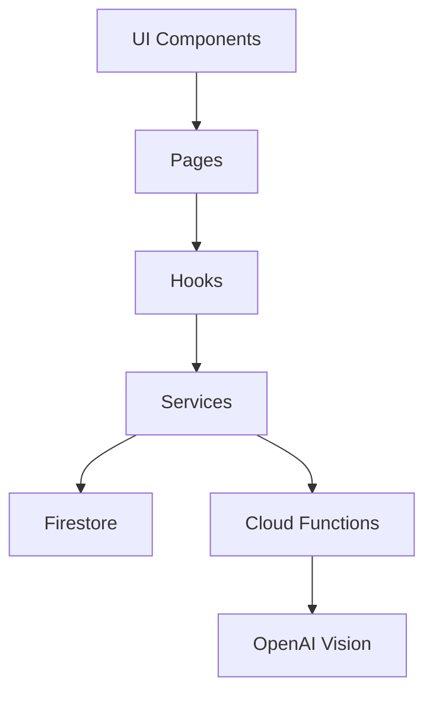
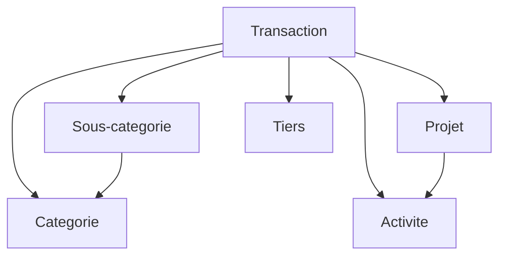
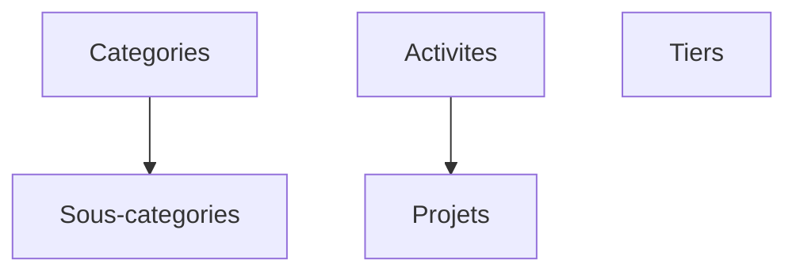
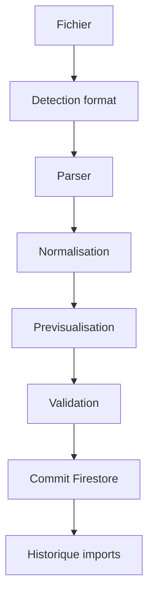

# Architecture Horizon

Version : 1.0
Statut : Constitution officielle
Date : 2026-08-05
Derniere mise a jour : 2026-08-05

Ce document est la reference technique officielle du projet Horizon.

Il decrit l'architecture constatee dans le code actuel. Quand une information n'est pas certaine, elle est signalee explicitement.

## Champ d'application
L'Architecture definit :
- l'organisation technique du projet ;
- les couches applicatives ;
- les flux de donnees ;
- les responsabilites code, hooks, services et stockage ;
- les contraintes d'implementation observees dans le code.

L'Architecture ne definit pas :
- la vision produit, definie dans HORIZON_PRODUCT_MANIFESTO ;
- les parcours et comportements UX, definis dans HORIZON_UX_GUIDELINES ;
- la composition visuelle et les composants, definis dans HORIZON_DESIGN_SYSTEM_V3 ;
- la priorisation des chantiers, definie dans HORIZON_PRODUCT_ROADMAP.

## Relation avec la hierarchie documentaire
L'Architecture est le rang 5 de la hierarchie documentaire Horizon. Elle applique les decisions produit, UX, design et roadmap sans les remplacer.

Toute exception technique necessaire a une regle produit, UX ou design doit etre documentee dans HORIZON_DECISION_RECORDS.md.

## 1. Objectifs

### Philosophie du projet

Horizon est une application de pilotage financier personnel construite autour de quatre idees directrices:

- interface React modulaire et reutilisable;
- logique metier centralisee plutot que dispersee dans les composants;
- Firestore comme source de verite applicative;
- reduction active du code duplique.

### Principes de conception

- Les composants UI doivent rester autant que possible presentatifs.
- Les hooks orchestrent le chargement, les actions utilisateur et l'etat local d'ecran.
- Les services concentrent les lectures et ecritures Firestore.
- Les calculs transverses doivent etre centralises, en particulier dans `src/services/financeCalculations.js`.
- Les referentiels doivent etre reutilises dans toute l'application au lieu de reencoder des valeurs libres dans chaque ecran.
- La duplication de logique metier est consideree comme un defaut d'architecture.

### Consequences concretes dans le code actuel

- Les ecritures Firestore passent par des services dedies (`transactionsService`, `accountsService`, `projectsService`, etc.).
- Les soldes, agregations et calculs budgetaires ne sont pas faits directement dans les composants mais dans les services et hooks.
- Le cockpit Horizon (`useDashboard`) s'appuie sur les transactions, comptes et transferts deja normalises.
- Le lot de mise a jour de transactions et le commit des imports bancaires utilisent `writeBatch` pour conserver une logique de persistance centralisee.

## 2. Architecture generale

### Vue d'ensemble

Architecture actuelle:

- Frontend React + Vite.
- Stockage principal: Firestore.
- Stockage secondaire disponible: Firebase Storage.
- Backend leger: Cloud Function HTTP `parseReceipt` pour l'analyse de tickets par vision.

### Flux principal

1. Les pages assemblent les composants de presentation.
2. Les hooks abonnent l'ecran aux donnees Firestore et exposent des actions de haut niveau.
3. Les services lisent et ecrivent Firestore, normalisent les payloads et appliquent les regles CRUD.
4. Les utilitaires et services de calcul centralisent les transformations transverses.
5. Les composants n'ecrivent pas directement dans Firestore.

### Source de verite

Firestore est la source de verite de l'application.

Constat dans le code:

- abonnements temps reel via `onSnapshot` dans les services;
- creation via `addDoc`;
- mise a jour via `updateDoc`;
- operations de lot via `writeBatch` pour les imports et editions de masse.

### Diagramme d'architecture generale

Le diagramme ci-dessous represente le flux technique general constate dans le code. La Cloud Function `parseReceipt` n'est pas sollicitee par tous les parcours utilisateur, mais elle existe bien dans l'architecture actuelle pour le flux ticket.



## 3. Arborescence du projet

Organisation actuelle constatee:

```text
src/
  components/
  constants/
  context/
  features/
  hooks/
  models/
  pages/
  services/
  styles/
  utils/
  firebase.js
  App.jsx

functions/
  src/

scripts/
  maintenance/

docs/
```

### Role des dossiers

- `src/components/`: composants UI reutilisables, dialogs, cards, champs de formulaire, widgets de synthese.
- `src/pages/`: ecrans fonctionnels (`Transactions`, `Budgets`, `Categories`, `Referentiels`, `Analyse`, `Parametres`, etc.).
- `src/hooks/`: orchestration d'etat et raccordement aux services.
- `src/services/`: acces Firestore, calculs et services transverses reutilisables.
- `src/utils/`: fonctions de transformation, normalisation, mapping et helpers d'analyse.
- `src/context/`: etat partage, en particulier `TransactionsContext`.
- `src/features/`: modules fonctionnels plus autonomes. Actuellement: `bankingImport` et `transfers`.
- `src/constants/`: catalogues et valeurs de reference.
- `src/models/`: dossier present dans l'arborescence, mais son role n'apparait pas central dans les fichiers examines.
- `functions/src/`: backend HTTP pour l'analyse de tickets.
- `scripts/`: scripts de seed, nettoyage et maintenance.
- `docs/`: documentation projet.

## 4. Composition applicative

### Navigation

`src/App.jsx` declare explicitement les pages suivantes:

- `HOME`
- `TRANSACTIONS`
- `OBJECTIFS`
- `FRAIS_FIXES`
- `REVENUS_RECURRENTS`
- `BUDGETS`
- `CATEGORIES`
- `REFERENTIELS`
- `ANALYSE`
- `PARAMETRES`

### Etat partage

- `TransactionsProvider` encapsule l'acces partage aux transactions.
- `useAccounts`, `useDashboard` et les hooks de referentiels restent desacouples du provider de transactions.

### Backend present

- La Cloud Function `parseReceipt` est deployable en `europe-west1`.
- Elle utilise un secret `OPENAI_API_KEY` et un modele par defaut `gpt-4.1-mini`.
- Elle sert a produire un brouillon de transaction issu d'une image de ticket.

## 5. Modele de donnees Firestore

Cette section distingue:

- les collections reellement evidentes dans le code applicatif;
- les collections mentionnees mais non modelisees par des services dedies;
- les collections demandees mais non verifiees comme pleinement implementees.

### 5.1 Collections metier evidentes dans le code

#### `transactions`

- Objectif: stocker les depenses et revenus saisis manuellement ou importes.
- Principaux champs observes: `date`, `montant`, `type`, `description`, `accountId`, `categoryId`, `categoryName`, `categorie`, `subcategoryId`, `subcategoryName`, `activityId`, `activityName`, `thirdPartyId`, `thirdPartyName`, `projectId`, `projectName`, `destinationAccountId`, `importId`, `importSource`, `importFormat`, `importFingerprint`, `bankReference`, `importedAt`, `createdAt`, `isDeleted`, `deletedAt`.
- Relations: vers `accounts`, `categories`, `subcategories`, `activities`, `thirdParties`, `projects`, et vers `bankImports` via `importId`.

#### `accounts`

- Objectif: stocker les comptes financiers suivis dans Horizon.
- Principaux champs observes: `name`, `type`, `icon`, `color`, `initialBalance`, `isActive`, `displayOrder`, `createdAt`, `updatedAt`, `deletedAt`.
- Relations: reference par `transactions.accountId`, `budgets.accountId`, `fixedExpenses.accountId`, `recurringIncome.accountId`, `transfers.sourceAccountId`, `transfers.destinationAccountId`, `bankImports.accountId`.
- Note: le service accepte un payload libre a la creation. Les champs ci-dessus sont ceux observes dans `useAccounts` et les usages du code.

#### `budgets`

- Objectif: definir des enveloppes budgetaires.
- Principaux champs observes: `name`, `categoryId`, `categoryName`, `accountId`, `amount`, `startDate`, `endDate`, `typeBudget`, `periodType`, `isActive`, `createdAt`, `updatedAt`.
- Relations: vers `categories` et optionnellement `accounts`; consommation calculee a partir des `transactions`.

#### `fixedExpenses`

- Objectif: definir les charges recurrentes attendues cote depense.
- Principaux champs observes: `name`, `categoryId`, `categoryName`, `category`, `accountId`, `frequency`, `initialAmount`, `startDate`, `endDate`, `variations`, `isActive`, `createdAt`, `updatedAt`.
- Relations: vers `categories` et `accounts`.

#### Reconciliation des frais fixes par echeance

- La reconciliation des frais fixes est centralisee dans `src/services/reconciliationService.js`.
- Le moteur construit un ledger d'echeances a partir des fiches `fixedExpenses` sur une periode donnee.
- Une echeance porte une seule valeur comptable de reference:
  - soit une `forecast` si aucune transaction n'est affectee ;
  - soit une `transaction` si une seule transaction est retenue ;
  - soit une `anomaly` si plusieurs transactions ciblent la meme echeance.
- L'affectation transaction -> echeance est globale sur la periode et a usage unique: une meme transaction ne peut pas couvrir deux echeances ni deux frais fixes simultanement dans le moteur de prevision.
- `annualTrajectoryService` et `forecastService` consomment ce ledger pour supprimer le double comptage entre reel et prevision.
- La page `FraisFixes` affiche les compteurs de preuve et le detail des echeances a partir de ce meme ledger, sans logique parallele cote interface.

#### `recurringIncome`

- Objectif: definir les revenus recurrents attendus.
- Principaux champs observes: `name`, `categoryId`, `categoryName`, `category`, `accountId`, `frequency`, `initialAmount`, `startDate`, `endDate`, `variations`, `isActive`, `createdAt`, `updatedAt`.
- Relations: vers `categories` et `accounts`.

#### `categories`

- Objectif: referentiel principal de categories de depense et de revenu.
- Principaux champs observes: `name`, `type`, `icon`, `color`, `displayOrder`, `isActive`, `createdAt`, `updatedAt`.
- Relations: referencee par `transactions`, `budgets`, `fixedExpenses`, `recurringIncome`, `subcategories`.

#### `subcategories`

- Objectif: referentiel secondaire lie a une categorie.
- Principaux champs observes: `name`, `categoryId`, `type`, `isActive`, `createdAt`, `updatedAt`.
- Relations: vers `categories` via `categoryId`; referencee par `transactions`.
- Note: le service expose `isSubcategoryUsed` pour verifier l'usage dans `transactions` et `deleteSubcategoryPermanently` pour suppression physique explicite.

#### `activities`

- Objectif: classer l'activite economique ou analytique d'une transaction.
- Principaux champs observes: `name`, `kind`, `isActive`, `createdAt`, `updatedAt`.
- Relations: referencee par `transactions`, `projects` via `activityId`.
- Valeurs `kind` observees: `profit_center`, `interest_center`, `mixed`.

#### `thirdParties`

- Objectif: referentiel de tiers.
- Principaux champs observes: `name`, `type`, `notes`, `isActive`, `createdAt`, `updatedAt`.
- Relations: referencee par `transactions`.
- Types observes: `client`, `supplier`, `administration`, `employer`, `bank`, `social_organization`, `individual`, `other`.

#### `projects`

- Objectif: referentiel de projets rattachables aux transactions.
- Principaux champs observes: `name`, `activityId`, `startDate`, `endDate`, `notes`, `isActive`, `createdAt`, `updatedAt`.
- Relations: vers `activities` via `activityId`; referencee par `transactions`.

#### `bankImports`

- Objectif: journaliser les imports bancaires et leur statut.
- Principaux champs observes: `importId`, `fileName`, `format`, `sourceBank`, `accountId`, `importedCount`, `skippedCount`, `duplicateCount`, `errorCount`, `startedAt`, `completedAt`, `status`, `failedRows`.
- Relations: source de rattachement pour les `transactions` et `transfers` importes via `importId`.

#### `transfers`

- Objectif: stocker les virements internes entre comptes comme un domaine distinct des transactions.
- Principaux champs observes: `date`, `amount`, `sourceAccountId`, `destinationAccountId`, `description`, `notes`, `isActive`, `createdAt`, `updatedAt`, `importId`, `importSource`, `importFormat`, `importFingerprint`, `bankReference`, `transferCandidate`, `transferConfidence`, `transferReasons`, `transferConfirmed`, `importedAt`.
- Relations: vers `accounts` pour le compte source et le compte destination; vers `bankImports` pour les imports.

#### `objectives`

- Objectif: stocker les objectifs financiers.
- Principaux champs observes: payload libre complete par `isActive`, `createdAt`, `updatedAt`; mise a jour ciblee possible de `currentAmount`.
- Relations: non detaillees dans les fichiers lus, mais collection clairement active dans le code.

### 5.2 Collections mentionnees mais non documentees par des services dedies dans `src/services`

#### `transactionDrafts`

- Objectif presume: persister des brouillons de transaction.
- Statut constate: collection mentionnee dans `maintenanceService` et dans l'ecran Parametres pour les operations de reset.
- Principaux champs: non verifies dans les fichiers lus.
- Relations: non verifiees.
- Conclusion: existence referencee par la maintenance, mais schema et service CRUD non identifies dans les fichiers examines.

#### `settings`

- Objectif presume: configuration globale.
- Statut constate: collection preservee lors d'un reset complet.
- Principaux champs: non verifies.
- Relations: non verifiees.

#### `preferences`

- Objectif presume: preferences utilisateur ou applicatives.
- Statut constate: collection preservee lors d'un reset complet.
- Principaux champs: non verifies.
- Relations: non verifiees.

#### `theme`

- Objectif presume: configuration de theme.
- Statut constate: collection preservee lors d'un reset complet.
- Principaux champs: non verifies.
- Relations: non verifiees.

#### `version`

- Objectif presume: metadonnees de version ou de migration.
- Statut constate: collection preservee lors d'un reset complet.
- Principaux champs: non verifies.
- Relations: non verifiees.

## 6. Modele transaction

### Champs principaux

Les champs ci-dessous sont effectivement manipules par les formulaires, les normalisateurs et les services:

- `type`: normalise vers `depense` ou `revenu`.
- `amount` / `montant`: le stockage transaction courant utilise surtout `montant`; l'import bancaire travaille d'abord avec `amount` avant mapping vers `montant`.
- `accountId`: compte source de la transaction.
- `categoryId`: identifiant categorie Firestore cible.
- `subcategoryId`: sous-categorie facultative.
- `activityId`: activite facultative.
- `thirdPartyId`: tiers facultatif.
- `projectId`: projet facultatif.
- `notes`: non observe comme champ standard dans le formulaire transaction principal lu; a ne pas considerer comme champ universel confirme pour toutes les transactions.
- `createdAt`: present sur les transactions importees et dans plusieurs services CRUD.
- `updatedAt`: pas injecte systematiquement par `transactionsService`, donc sa presence depend du payload fourni par l'appelant.
- `legacyType`: champ derive a la lecture par `normalizeTransactionRecord`, pas un champ explicitement persiste par `createTransaction`.
- `needsTypeReview`: champ derive a la lecture quand `type` porte une ancienne valeur de type non standard.

### Relations

- `accountId` pointe vers `accounts`.
- `categoryId` pointe vers `categories`.
- `subcategoryId` pointe vers `subcategories`.
- `activityId` pointe vers `activities`.
- `thirdPartyId` pointe vers `thirdParties`.
- `projectId` pointe vers `projects`.
- `importId` rattache une transaction a `bankImports`.

### Particularites importantes

- `transactionsService` force `destinationAccountId` a `null` pour une transaction standard.
- Les virements internes ne doivent pas etre modelises comme des transactions ordinaires.
- Une transaction legacy de type `virement`, `transfer` ou `transfert` peut etre detectee comme type historique a reviser.
- La compatibilite legacy est maintenue avec `categorie`, `categoryName` et `categoryId`.

### Diagramme du modele transaction

Le code actuel montre que la transaction peut referencer plusieurs dimensions metier facultatives. Le diagramme ci-dessous represente ces liens logiques sans supposer de contrainte supplementaire non codee.



## 7. Referentiels

### Categories

- Role: regrouper les flux financiers par nature metier.
- Independence: le referentiel categories existe en tant que collection propre.
- Relations: parents des sous-categories; reference directe de transactions, budgets, frais fixes et revenus recurrents.

### Sous-categories

- Role: affiner une categorie sans reencoder de logique libre dans les transactions.
- Independence: collection autonome avec lien simple `categoryId`.
- Relations: une sous-categorie appartient a une categorie; une transaction peut pointer une sous-categorie.

### Activites

- Role: porter une lecture analytique transverse distincte des categories comptables.
- Independence: collection autonome, non derivee d'une categorie.
- Relations: rattachement possible des transactions et des projets.

### Tiers

- Role: decrire l'entite en face du mouvement financier.
- Independence: un tiers est un referentiel propre, distinct des categories.
- Relations: rattachement facultatif aux transactions.

### Projets

- Role: ajouter une dimension projet sur les transactions.
- Independence: collection autonome, avec lien optionnel vers une activite.
- Relations: rattachement facultatif aux transactions; lien optionnel `activityId`.

### Regle importante: un tiers ne determine jamais automatiquement une categorie

Cette regle est coherente avec le code actuel:

- `suggestCategory()` retourne aujourd'hui une suggestion neutre (`categoryId: null`).
- Le test `suggestCategory remains neutral and does not map merchant to category` verrouille explicitement ce comportement.
- En consequence, un fournisseur, un marchand ou un tiers ne doit jamais fixer automatiquement une categorie sans validation explicite.

Motif architectural:

- un meme tiers peut produire des flux de natures differentes;
- la categorie est une decision metier, pas une deduction automatique fiable;
- les referentiels doivent rester independants.

### Diagramme des referentiels

Le diagramme ci-dessous ne montre que les relations effectivement visibles dans le code actuel.



## 8. Import bancaire

### Pipeline actuel

Pipeline constate dans `src/features/bankingImport/`:

1. detection du format (`detectFileFormat`);
2. lecture du fichier;
3. analyse structurelle et mapping CSV;
4. parsing du fichier;
5. normalisation des lignes importees;
6. previsualisation;
7. detection des doublons;
8. validation metier ligne par ligne;
9. commit Firestore en `transactions` ou `transfers`;
10. historisation dans `bankImports`.

### Diagramme du pipeline d'import bancaire

Le diagramme represente le pipeline reellement observe dans `src/features/bankingImport/`. Il ne signifie pas que tous les formats detectes sont deja supportes jusqu'au commit.



### Etapes implementees

- Detection de format: implemente.
- Mapping CSV: implemente.
- Preview CSV: implemente.
- Validation CSV: implemente.
- Detection de doublons: implemente.
- Reconciliation avec le solde du compte: implemente.
- Commit Firestore avec lot et journal d'import: implemente.
- Historique des imports via `bankImports`: implemente.

### Normalisation

La normalisation d'une ligne importee produit notamment:

- `operationDate`
- `valueDate`
- `rawLabel`
- `normalizedLabel`
- `merchant`
- `amount`
- `type`
- `accountId`
- identifiants referentiels (`categoryId`, `subcategoryId`, `activityId`, `thirdPartyId`, `projectId`)
- `fingerprint`
- statut de doublon
- statut de validation
- indicateurs de candidat transfert

### Doublons

- Les doublons sont detectes pendant la preview.
- La validation introduit une decision utilisateur (`import`, `skip`, `review`).
- Un doublon exact est preselectionne en `skip`.

### Transferts pendant l'import

- Les candidats transfert ne sont jamais convertis automatiquement.
- La conversion vers la collection `transfers` exige une confirmation explicite et le choix des comptes source/destination.
- Cette regle est affichee dans la UI de validation de l'import.

### Historique des imports

Chaque import committe cree ou met a jour une entree dans `bankImports` avec:

- compte cible;
- format;
- nombre importe;
- nombre ignore;
- nombre de doublons;
- nombre d'erreurs;
- statut (`started`, `completed`, `partial_failure`, `failed`).

### Statut des formats

- CSV: termine pour la premiere fondation d'import bancaire exposee dans la UI.
- OFX: detection presente; parseur placeholder; non expose en preview/commit.
- QIF: detection presente; parseur placeholder; non expose en preview/commit.
- PDF: detection presente; parseur placeholder; non expose en preview/commit.
- CAMT.053: detection presente; parseur placeholder; non expose en preview/commit.
- MT940: detection presente; parseur placeholder; non expose en preview/commit.
- XLSX: parseur placeholder present mais non demande dans la roadmap utilisateur fournie ici.

### Limite explicite actuelle

Le wizard bancaire refuse aujourd'hui tout format non CSV avec le message indiquant que seule la previsualisation CSV est implementee dans cette premiere version.

## 9. Transferts

### Modele

Les transferts sont un domaine dedie, distinct des transactions.

Champs observes:

- `date`
- `amount`
- `sourceAccountId`
- `destinationAccountId`
- `description`
- `notes`
- `isActive`
- `createdAt`
- `updatedAt`

Des champs d'import peuvent s'y ajouter lors d'un import bancaire.

### Validation

Validation centralisee dans `src/features/transfers/utils/transferValidation.js`:

- date obligatoire;
- compte source obligatoire;
- compte destination obligatoire;
- comptes source et destination differents;
- montant strictement positif.

### Calculs

- `calculateTransferImpactByAccount` renvoie l'impact negatif sur le compte source et positif sur le compte destination.
- `calculateTransfersNetImpact` somme les impacts de tous les transferts.
- Le test de calcul des soldes confirme que les transferts n'impactent pas le patrimoine net global, seulement la repartition entre comptes.

### Pourquoi un transfert n'est pas une depense

- un transfert deplace de la tresorerie entre deux comptes Horizon;
- il ne represente ni une consommation externe, ni un revenu;
- le traiter comme une depense fausserait les analyses, budgets et soldes par nature;
- la logique de solde de compte sait deja integrer les transferts separerement des transactions.

## 10. Dialogs et UX de formulaires

### EntityFormDialog

`src/components/EntityFormDialog.jsx` est le wrapper de dialog generique actuellement present.

Caracteristiques constatees:

- `fullScreen` sur mobile (`max-width:600px`);
- `scroll="paper"`;
- actions sticky en bas;
- largeur configurable (`maxWidth`);
- prevention de fermeture pendant soumission via `submitting`.

### Formulaires qui l'utilisent deja

Usage verifie dans le code:

- `BudgetForm`
- `CategoryForm`
- `FixedExpenseForm`
- `ObjectiveForm`
- `RecurringIncomeForm`

### Dialogs specifiques encore distincts

- `TransactionEditorDialog` est specifique au flux transaction.
- `TransactionBulkEditDialog` gere les actions de masse.
- `TransactionDraftReviewDialog` gere la validation des brouillons IA/voix/ticket.

### Regles UX constatees

- mobile: dialogs plein ecran ou adaptes au petit ecran;
- desktop: largeur contrainte et actions visibles;
- fermeture de dialog parfois bloquee pendant soumission;
- confirmations de suppression encore gerees localement dans plusieurs cards.

### Point de maturite

Le projet avance vers une uniformisation des formulaires via un dialog generique, mais cette uniformisation n'est pas encore totale.

## 11. Services importants

Cette section documente le role attendu de chaque service et ce qu'il ne doit pas faire.

### `transactionsService`

- Responsabilite: CRUD des transactions, normalisation minimale du payload transaction.
- Interdictions: ne pas gerer les transferts; ne pas dupliquer la logique de calcul analytique; ne pas embarquer d'etat UI.

### `accountsService`

- Responsabilite: CRUD des comptes et abonnement comptes actifs.
- Interdictions: ne pas recalculer les soldes metier dans le service CRUD lui-meme.

### `categoriesService`

- Responsabilite: CRUD categories et seed initial.
- Interdictions: ne pas coder la logique de matching transaction/categorie dans les composants.

### `subcategoriesService`

- Responsabilite: CRUD sous-categories, verification d'usage par transactions, suppression physique explicite.
- Interdictions: ne pas dupliquer la logique de compatibilite categorie/sous-categorie ailleurs.

### `activitiesService`

- Responsabilite: CRUD activites et normalisation du champ `kind`.
- Interdictions: ne pas se substituer aux categories pour classifier la nature comptable.

### `thirdPartiesService`

- Responsabilite: CRUD tiers.
- Interdictions: ne pas imposer automatiquement une categorie a partir d'un tiers.

### `projectsService`

- Responsabilite: CRUD projets et lien optionnel vers une activite.
- Interdictions: ne pas porter de logique analytique du dashboard.

### `budgetsService`

- Responsabilite: CRUD budgets et calcul de metriques budgetaires.
- Interdictions: ne pas dupliquer les calculs transverses deja centralises dans `financeCalculations`.

### `fixedExpensesService`

- Responsabilite: CRUD frais fixes attendus.
- Interdictions: ne pas recalculer les projections globales hors service de prevision.

### `recurringIncomeService`

- Responsabilite: CRUD revenus recurrents et calcul du montant applicable a une date.
- Interdictions: ne pas faire de calcul global de tresorerie.

### `objectivesService`

- Responsabilite: CRUD objectifs et mise a jour du montant courant.
- Interdictions: ne pas etendre son schema libre sans mise a jour documentaire.

### `financeCalculations`

- Responsabilite: calculs transverses partages (matching, soldes, budgets, filtres de dates).
- Interdictions: ne pas etre duplique dans les pages ou composants.

### `transactionBulkUpdateService` et `transactionBulkUpdateCore`

- Responsabilite: edition de masse et validation de patchs transaction.
- Interdictions: ne pas contourner les normalisations transaction standard.

### `features/transfers/services/transfersService`

- Responsabilite: CRUD transferts.
- Interdictions: ne pas reutiliser la collection `transactions` pour les virements internes.

### `features/bankingImport/services/*`

- Responsabilite: detection de format, preview, validation, suggestions, reconciliation et commit des imports.
- Interdictions: ne pas ecrire directement en Firestore depuis un composant UI; ne pas auto-convertir un candidat transfert sans confirmation.

### `maintenanceService`

- Responsabilite: reset et operations de maintenance par collection.
- Interdictions: ne pas etre appele comme logique metier applicative courante.

### `receiptParserService`

- Responsabilite: dialogue HTTP avec la Cloud Function de parsing de tickets et mapping des erreurs.
- Interdictions: ne pas embarquer la cle OpenAI cote client; ne pas considerer la suggestion de categorie comme une decision definitive.

## 12. Tests et validation

### Tests unitaires

Le projet contient des tests unitaires et de service bases sur `node:test`.

Surfaces verifiees dans les fichiers lus:

- services de referentiels (`projectsService`, `subcategoriesService`, `thirdPartiesService`, etc.);
- calculs financiers;
- edition de masse;
- import bancaire;
- mapping et intelligence ticket;
- parsing vocal.

### Tests fonctionnels

- Aucune suite end-to-end dediee n'a ete identifiee dans les fichiers lus.
- La validation fonctionnelle semble aujourd'hui reposer sur des tests manuels dans l'application.

### Build

- Le document de statut Horizon existant indique un build passant a la date de reference.
- Le frontend repose sur Vite.

### Validation utilisateur

- La validation utilisateur reelle est une etape distincte des tests automatises.
- Elle est deja exigee par les regles du tableau de bord Horizon avant de marquer un sprint termine.

## 13. Regles d'architecture

Section obligatoire. Ces regles doivent guider toute evolution future.

- Ne jamais dupliquer une logique metier deja existante ailleurs.
- Centraliser les validations quand elles concernent plusieurs ecrans ou plusieurs flux.
- Les services sont les seuls a ecrire dans Firestore.
- Les composants restent autant que possible presentatifs.
- Reutiliser un composant existant avant d'en creer un nouveau.
- Reutiliser `financeCalculations` avant d'introduire un nouveau calcul concurrent.
- Un transfert interne ne doit jamais etre encode comme une depense standard.
- Un tiers ne doit jamais imposer automatiquement une categorie.
- Les referentiels sont independants les uns des autres et relies par identifiants explicites.
- Toute compatibilite legacy doit etre isolee dans des normalisateurs ou services, pas dispersee dans la UI.
- Toute ecriture de masse doit passer par un service centralise et, quand c'est pertinent, par un batch Firestore.

## 14. Evolutions futures

Cette section ne decrit pas des fonctionnalites confirmees en code, mais les axes explicitement visibles dans la roadmap et les surfaces existantes.

### Learning Patterns

- Base utile deja presente: brouillons ticket, parsing vocal, import bancaire et suggestions neutres.
- Travail futur attendu: apprentissage des decisions utilisateur sans court-circuiter la validation humaine.

### Regles automatiques

- Zone naturelle d'evolution: preclassification import, aide au classement et automatisation controlable.
- Vigilance: conserver la tracabilite et la possibilite de revue manuelle.

### Dashboard V4

- Base utile deja presente: `useDashboard`, page Analyse, categories mensuelles, tendances et soldes.
- Evolution attendue: analyses multidimensionnelles, graphiques enrichis et previsions plus fortes.

### IA

- Base utile deja presente: Cloud Function `parseReceipt`, service client de tickets, parsing vocal.
- Vigilance: les sorties IA doivent rester des propositions, pas des verites metier.

### Import bancaire avance

- Base utile deja presente: detection multi-format et pipeline CSV complet.
- Evolution attendue: OFX, QIF, PDF, CAMT.053, MT940 et possiblement XLSX.

### Recherche universelle

- Non identifiee comme module implemente dans les fichiers lus.
- Evolution plausible pour exploiter les referentiels et les transactions sur plusieurs ecrans.

## 15. Maintenance documentaire

- Toute evolution importante doit mettre a jour `docs/ARCHITECTURE.md`.
- Toute nouvelle collection Firestore doit y etre documentee.
- Tout nouveau service doit y etre documente.
- Toute modification majeure de pipeline d'import, de transfert ou de transaction doit y etre documentee.
- Toute regle metier transverse introduite doit y etre documentee dans la section architecture ou regles.

### Mise a jour documentaire obligatoire

Toute modification touchant l'un des sujets suivants doit obligatoirement mettre a jour la documentation:

- une collection Firestore;
- un referentiel;
- une relation metier;
- une Cloud Function;
- un pipeline d'import;
- une architecture UI.

La mise a jour doit alors concerner au minimum:

- `docs/ARCHITECTURE.md`;
- `docs/HORIZON_V1_TECHNICAL_STATUS.md`;
- l'ADR concerne si la decision d'architecture evolue.

### Regle de synchronisation documentaire

- `ARCHITECTURE.md` reste la reference technique structurelle.
- `HORIZON_V1_TECHNICAL_STATUS.md` reste le tableau de bord d'etat et de priorisation.
- Les ADR documentent le pourquoi des decisions structurantes.
- Aucune evolution structurelle importante ne doit etre fusionnee avec une documentation desynchronisee.

## 16. Points de vigilance actuels

- La convention de soft delete n'est pas encore unifiee entre domaines (`isActive` vs `isDeleted`).
- Le modele transaction garde une couche de compatibilite legacy (`categorie`, `legacyType`, `needsTypeReview`).
- Les collections `settings`, `preferences`, `theme`, `version` et `transactionDrafts` sont mentionnees par la maintenance mais non schemaes ici faute de service dedie identifie.
- Le flux d'import bancaire expose en UI est aujourd'hui reellement limite au CSV, meme si la detection de formats est plus large.
- L'uniformisation complete de tous les formulaires autour d'un dialog generique n'est pas encore terminee.

## 17. Resume pour un nouveau developpeur

Pour comprendre Horizon rapidement:

1. Lire `src/App.jsx` pour la composition generale.
2. Lire `src/context/TransactionsContext.jsx` puis les hooks `use*` pour comprendre le chargement des donnees.
3. Lire `src/services/` pour les regles CRUD et `financeCalculations`.
4. Lire `src/features/bankingImport/` et `src/features/transfers/` pour les domaines specifiques.
5. Lire `docs/HORIZON_V1_TECHNICAL_STATUS.md` pour le pilotage produit et la priorisation.

Le point cle de l'architecture actuelle est simple: Firestore est la source de verite, les services portent la persistence, les hooks orchestrent, les composants affichent, et la logique metier doit rester centralisee.
## Chargement des pages V1

Les pages fonctionnelles sont declarees avec `React.lazy` dans `src/App.jsx` et rendues sous un unique `Suspense`. Le layout, l'authentification et les providers globaux restent synchrones; chaque page et ses hooks specifiques ne sont charges qu'a sa premiere ouverture. Le fallback commun porte un statut accessible. Toute nouvelle page doit conserver cette convention et etre ajoutee au catalogue `src/navigation/appNavigation.js`.